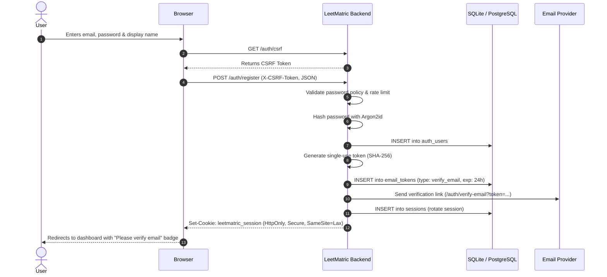
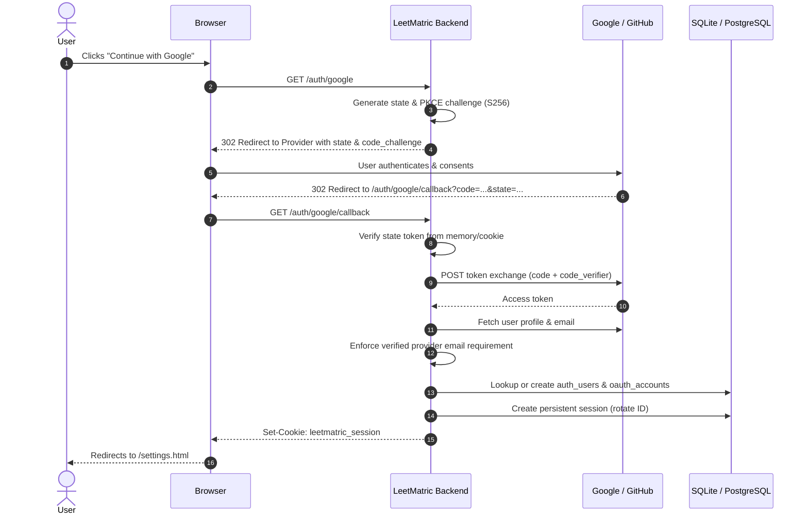

# Authentication & Authorization Architecture

This document describes the additive authentication (signup/signin) and per-user access control (authorization) system for LeetMatric.

---

## 1. OAuth Redirect URLs to Register

When creating the Google and GitHub OAuth applications in their developer consoles, register the following exact callback URLs:

### Local Development (http://localhost:3000)
- **Google Authorized Redirect URI**: `http://localhost:3000/auth/google/callback`
- **GitHub Authorization Callback URL**: `http://localhost:3000/auth/github/callback`

### Production (https://leetlytics.onrender.com)
- **Google Authorized Redirect URI**: `https://leetlytics.onrender.com/auth/google/callback`
- **GitHub Authorization Callback URL**: `https://leetlytics.onrender.com/auth/github/callback`

---

## 2. Environment Variables Reference

| Variable | Description | Default | Required for Auth |
| :--- | :--- | :--- | :--- |
| `AUTH_ENABLED` | Feature flag. When `false`, zero auth routes or UI changes are active. | `false` | Yes (`true` to enable) |
| `APP_URL` | Canonical origin for email links and redirects. | `http://localhost:3000` | Recommended in production |
| `SESSION_SECRET` | Secret key for signing cookies and CSRF synchronizers. | Random fallback | Recommended |
| `GOOGLE_CLIENT_ID` | Google OAuth 2.0 Web Client ID. | - | Optional (for Google login) |
| `GOOGLE_CLIENT_SECRET` | Google OAuth 2.0 Client Secret. | - | Optional (for Google login) |
| `GOOGLE_CALLBACK_URL` | Explicit Google OAuth callback override. | Derived from request | Optional |
| `GITHUB_CLIENT_ID` | GitHub OAuth App Client ID. | - | Optional (for GitHub login) |
| `GITHUB_CLIENT_SECRET` | GitHub OAuth App Client Secret. | - | Optional (for GitHub login) |
| `GITHUB_CALLBACK_URL` | Explicit GitHub OAuth callback override. | Derived from request | Optional |
| `EMAIL_PROVIDER` | Email delivery service: `console`, `resend`, or `brevo`. | `console` | No (defaults to console log) |
| `EMAIL_API_KEY` | API key for Resend or Brevo. | - | If using external email |
| `EMAIL_FROM` | Sender address for outgoing emails. | `noreply@leetlytics.onrender.com` | No |

---

## 3. Sequence Diagrams

### Email & Password Sign Up Flow

### Social Login (Google / GitHub OAuth 2.0 with PKCE)

---

## 4. Threat Model & Security Controls

| Threat | Attack Vector | Mitigation in LeetMatric |
| :--- | :--- | :--- |
| **Credential Stuffing & Brute Force** | Automated dictionary attacks against `/auth/login` | Lockout after 5 failed attempts within 15 minutes (`429 ACCOUNT_LOCKED`). |
| **Account Enumeration** | Timing or error messages distinguishing valid vs invalid emails | Identical generic 401 response shape & message for missing user vs bad password. Dummy hash executed on missing email to equalize timing. Password reset returns identical success notice regardless of email existence. |
| **Session Fixation & Hijacking** | Reusing pre-auth session ID or stealing cookies via XSS | Session IDs rotated on login; stored in `HttpOnly`, `SameSite=Lax`, and `Secure` cookies. Zero tokens stored in `localStorage`. |
| **CSRF Attacks** | Cross-origin form submission or state-changing requests | Synchronizer token enforced on all `POST`, `PUT`, `PATCH`, `DELETE` routes via `X-CSRF-Token`. |
| **IDOR (Insecure Direct Object References)** | Attacker sending another user's ID in request payload | Central permission layer filters all private queries by `req.authUser.id` obtained strictly from the validated server session. Client-supplied user IDs are completely ignored. |
| **Weak Passwords** | Dictionary or trivial passwords | Minimum 8 characters, common passwords blocklist check, and real-time client & server validation. |
| **Token Hijacking & Replay** | Stealing verification/reset links from logs or history | Single-use only, expiring tokens (1 hour for reset, 24 hours for verification), stored as SHA-256 hashes in database. |
| **OAuth Identity Spoofing** | Registering unverified email on third-party provider | Strict check requiring provider verified email (`email_verified` on Google, verified email check on GitHub). Accounts are not auto-linked to existing users unless both provider email and existing account are verified. |

---

## 5. Render Deployment Parity Notes

1. **HTTPS Enforcement**: Render automatically terminates TLS and routes traffic with the `X-Forwarded-Proto: https` header. Cookie flags dynamically include `Secure` in production and under HTTPS proxies.
2. **Ephemeral vs Persistent Storage**:
   - Free-tier Render instances run on an ephemeral disk. To prevent session or account loss during redeployments, provision a managed PostgreSQL database on Render and set `DATABASE_URL` in the Environment tab.
   - The auth system automatically detects PostgreSQL when `DATABASE_URL` is set and applies identical schemas and constraints using `pg`.
